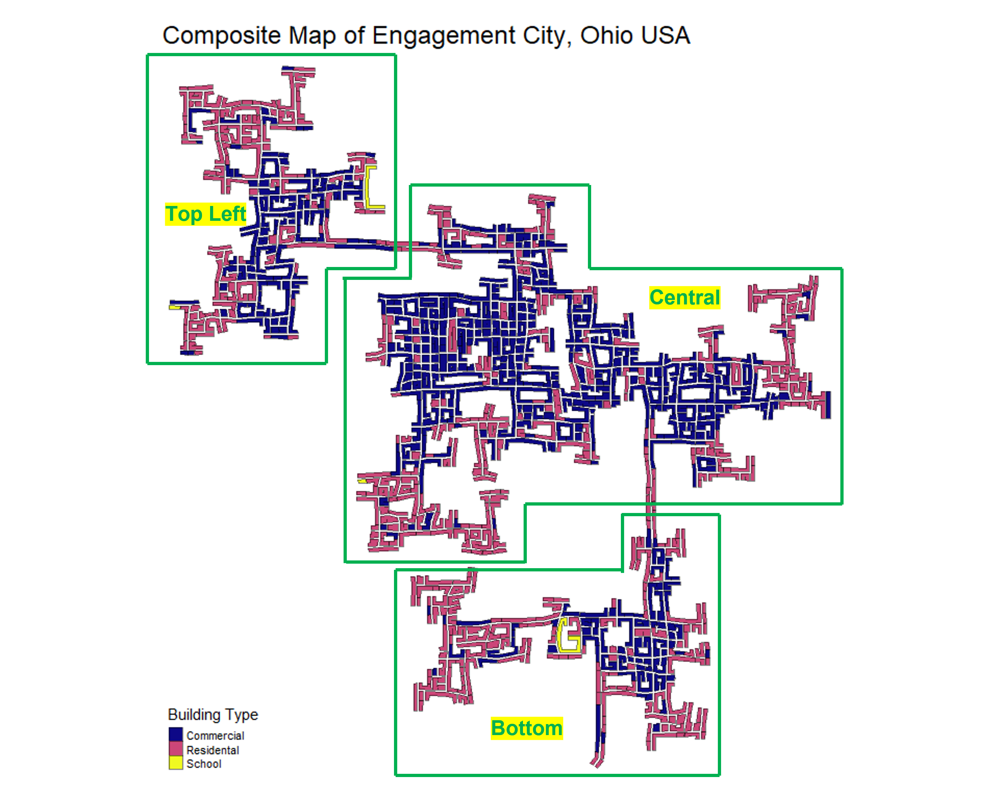

```{r setup, include=FALSE}
knitr::opts_chunk$set(echo = TRUE, 
                      eval = TRUE, 
                      warning = FALSE, 
                      message = FALSE)
```

# Overview

In this take-home exercise, I will be attempting to analyze the traffic bottlenecks of the city of Engagement, Ohio USA.

# Getting Started

Before I get started, it is important for us to ensure that the required R packages have been installed. If yes, we will load the R packages. If they have yet to be installed, I will install the R packages and load them onto R environment.


```{r echo = TRUE}
packages = c("tidyverse","sf","tmap","lubridate","clock","sftime","rmarkdown","plotly")

for(p in packages){
  if(!require(p, character.only = T)){
    install.packages(p)
    }
  library(p, character.only = T)
  }
```

# Importing Data

The code chunk below imports *ParticipantStatusLogs1.csv* from the data folder, into R by using [`read_csv()`](https://readr.tidyverse.org/reference/read_delim.html) of [**readr**](https://readr.tidyverse.org/) and save it as an tibble dataframe called *participant_log1*.

This imported dataset is just 1 of the 72 ParticipantStatusLogs[n].csv that records all the 1000+ participants across a 15-month period.

```{r}
buildings <- read_sf("data/wkt/Buildings.csv", 
                   options = "GEOM_POSSIBLE_NAMES=location")

employers <- read_sf("data/wkt/Employers.csv", 
                   options = "GEOM_POSSIBLE_NAMES=location")

apartments <- read_sf("data/wkt/Apartments.csv", 
                   options = "GEOM_POSSIBLE_NAMES=location")

schools <- read_sf("data/wkt/Schools.csv", 
                   options = "GEOM_POSSIBLE_NAMES=location")

pubs <- read_sf("data/wkt/Pubs.csv", 
                   options = "GEOM_POSSIBLE_NAMES=location")

restaurants <- read_sf("data/wkt/Restaurants.csv", 
                   options = "GEOM_POSSIBLE_NAMES=location")

```

### Plotting the Composite Map

With the code chunk below, I was able to colour code the respective building types with the metadata "buildingType" from the Buildings.csv.

```{r fig.height= 8, fig.width= 10, eval=FALSE}
tmap_mode("plot")
tmap_style("white")
tm_shape(buildings) +
tm_polygons(col = "buildingType",
           palette="plasma",
           border.col = "black",
           border.alpha = .5,
           border.lwd = 0.5,
           title = "Building Type") +
tm_layout(main.title = 'Composite Map of Engagement City, Ohio USA',
          frame = FALSE)
```

From the composite map plotted, it seems like the City can be split into 3 distinct regions,

* Top Left Region
* Central Region
* Bottom Region



As shown with respect to the plotted map, it is clear that residential areas (pink) are situated mostly at the edges/corners of the city, while the commercial areas (blue) are very much in the center of this city, with smaller congregation of them in the top left and bottom right corner of the city.

It is also noted that the 4 schools (yellow) are located in the,

* Top Left Region (2 schools)
* Bottom left corner of the Central Region (1 school)
* Bottom Region (1 school)

### Adding details

On top of the initial composite map done earlier, additional markers of various location types are added too.

* Employers (blue dot)
* Apartments (red dot)
* Schools (green dot)
* Pubs (yellow dot)
* Restaurants (cyan dot)

```{r fig.height= 8, fig.width= 10}
tmap_mode("plot")
tmap_style("white")
tm_shape(buildings) +
tm_polygons(col = "buildingType",
           palette="plasma",
           border.col = "black",
           border.alpha = .5,
           border.lwd = 0.5,
           title = "Building Type") +
tm_shape(employers) + 
  tm_dots(col = "blue", size = 0.3, alpha= 0.7) +
tm_shape(apartments) + 
  tm_dots(col = "red", size = 0.3, alpha= 0.7) +
tm_shape(schools) + 
  tm_dots(col = "green", size = 1, alpha= 0.7) +
tm_shape(pubs) + 
  tm_dots(col = "yellow", size = 0.7, alpha= 0.7) +
tm_shape(restaurants) + 
  tm_dots(col = "cyan", size = 0.7, alpha= 0.7) +
tm_add_legend(title = 'Location Types',
              type = 'symbol',
              border.col = NA,
              labels = c('Employers', 'Apartments', 'Schools', 'Pubs', 'Restaurants'),
              col = c('blue', 'red', "green", 'yellow', 'cyan')) +
tm_layout(main.title = 'Composite Map of Engagement City, Ohio USA',
          frame = FALSE)
```

Here in this tmap output, we can now visualize where the schools, pubs and restaurants are.

## How bad is the traffic?

### Importing the necessary files

Multiple ParticipantStatusLogs[n].csv files were read in with [`read_sf`](https://r-spatial.github.io/sf/reference/st_read.html) of the [sf](https://r-spatial.github.io/sf/index.html) package.

```{r eval=FALSE}
logs1 <- read_sf("data/wkt/ParticipantStatusLogs1.csv",
                options = "GEOM_POSSIBLE_NAMES=currentLocation")
logs2 <- read_sf("data/wkt/ParticipantStatusLogs2.csv",
                options = "GEOM_POSSIBLE_NAMES=currentLocation")
logs3 <- read_sf("data/wkt/ParticipantStatusLogs3.csv",
                options = "GEOM_POSSIBLE_NAMES=currentLocation")
logs4 <- read_sf("data/wkt/ParticipantStatusLogs4.csv",
                options = "GEOM_POSSIBLE_NAMES=currentLocation")
logs5 <- read_sf("data/wkt/ParticipantStatusLogs5.csv",
                options = "GEOM_POSSIBLE_NAMES=currentLocation")
logs6 <- read_sf("data/wkt/ParticipantStatusLogs6.csv", 
                options = "GEOM_POSSIBLE_NAMES=currentLocation")
```

### Wrangling the imported files

Subsequently, the respective imported ParticipantStatusLogs were wrangled and cleaned,

* Parsing the timestamp as the original timestamp was not read as the appropriate format,
* Filtering only for data that is tagged as "Transport" in the column "currentMode",
* Selecting/keeping the 2 columns that is required (to optimize file size)
  * currentLocation, which provides the participants' position at the respective timestamps
  * Timestamp

```{r eval=FALSE}
logs1_selected <- logs1 %>%
  mutate(Timestamp = date_time_parse(timestamp,
                                     zone="",
                                     format="%Y-%m-%dT%H:%M:%S")) %>%
  mutate(day = get_day(Timestamp)) %>%
  filter(currentMode == "Transport") %>% 
  select(currentLocation,Timestamp)

logs2_selected <- logs2 %>%
  mutate(Timestamp = date_time_parse(timestamp,
                                     zone="",
                                     format="%Y-%m-%dT%H:%M:%S")) %>%
  mutate(day = get_day(Timestamp)) %>%
  filter(currentMode == "Transport") %>% 
  select(currentLocation,Timestamp)

logs3_selected <- logs3 %>%
  mutate(Timestamp = date_time_parse(timestamp,
                                     zone="",
                                     format="%Y-%m-%dT%H:%M:%S")) %>%
  mutate(day = get_day(Timestamp)) %>%
  filter(currentMode == "Transport") %>% 
  select(currentLocation,Timestamp)

logs4_selected <- logs4 %>%
  mutate(Timestamp = date_time_parse(timestamp,
                                     zone="",
                                     format="%Y-%m-%dT%H:%M:%S")) %>%
  mutate(day = get_day(Timestamp)) %>%
  filter(currentMode == "Transport") %>% 
  select(currentLocation,Timestamp)

logs5_selected <- logs5 %>%
  mutate(Timestamp = date_time_parse(timestamp,
                                     zone="",
                                     format="%Y-%m-%dT%H:%M:%S")) %>%
  mutate(day = get_day(Timestamp)) %>%
  filter(currentMode == "Transport") %>% 
  select(currentLocation,Timestamp)

logs6_selected <- logs6 %>%
  mutate(Timestamp = date_time_parse(timestamp,
                                     zone="",
                                     format="%Y-%m-%dT%H:%M:%S")) %>%
  mutate(day = get_day(Timestamp)) %>%
  filter(currentMode == "Transport") %>% 
  select(currentLocation,Timestamp)
```

### Additional filtering for respective timestamps

For ParticipantStatusLog6.csv, an additional filter was applied to remove records that are in Apr 2022.

```{r eval=FALSE}
logs6_selected <- logs6_selected %>%
  filter(Timestamp < '2022-04-01 00:00:00')
```

### Append the sf dataframe

After cleaning the logs, they are appended with 'rbind' function into 1 single sf dataframe.

```{r eval=FALSE}
transport_log_mar_22 <- rbind(logs1_selected,logs2_selected,logs3_selected,logs4_selected,logs5_selected,logs6_selected)
```

```{r echo=FALSE, eval= FALSE}
write_rds(transport_log_mar_22, "data/rds/transport_log_mar_22.rds")
```

```{r echo=FALSE}
transport_log_mar_22 <- read_rds("data/rds/transport_log_mar_22.rds")
```

### Data preparation of March 2022 data for Hexagon Binning

Now that we have the transport logs tabulated, we will need to prepare the hexagon map as the base layer for visualization of the traffic density.

```{r}
hex <- st_make_grid(buildings,
cellsize=100,
square=FALSE) %>%
st_sf() %>%
rowid_to_column('hex_id')
```

Next, we will use [`st_join`](https://r-spatial.github.io/sf/reference/st_join.html) to join the transport log's position count data into the hex grid that was created in the previous step, in order to assign a hex_id to the respective position with their count value.

```{r}
points_in_hex_mar_22 <- st_join(transport_log_mar_22,
                                hex,
                                join=st_within) %>% 
  st_set_geometry(NULL) %>%
  count(name='pointCount', hex_id)
```

The following step will then join the 2 tables (hex_grid and the previous table that has the respective counts in their hex_id assigned) on similar hex_id to get the cleaned dataframe that can then be used for tmap plotting.

```{r}
hex_combined_mar_22 <- hex %>%
  left_join(points_in_hex_mar_22,
            by = 'hex_id') %>%
  replace(is.na(.), 0)
```

### Plotting the Hexagon Binning Map with March 2022 data

The code chunk below will then plot the Hexagon Binning Map with the March 2022 data that we have extracted and cleaned earlier.
A noticeable parameter edit is the "breaks" assigned to the bins written, instead of specifying the number of bins (n="X number") and using style = "quantile".

Rationale is for better comparison with December 2022 data later on in the article.

```{r fig.height= 8, fig.width= 10}
hexmap1 <- tm_shape(hex_combined_mar_22 %>%
                      filter(pointCount > 0)) +
  tm_fill("pointCount",
          breaks = c(0, 100, 500, 1000, 5000, 7000, 10000),
          style = "fixed",
          title = 'Traffic Count') + 
  tm_borders(alpha = 0.1) +
  tm_layout(main.title = 'Hexagon Binning Map of Engagement City\nMarch 2022',
            frame = FALSE)
hexmap1
```

As seen from the hexagon binning map, it is obvious that the route that has high traffic (dense) are the areas/paths that links up the whole map, which is understandable as these are routes that are unavoidable if the participants wants/needs to travel to the different sectors of the city.

### Importing the necessary files to look at December 2022 data 

Now that we have looked at March 2022's traffic data via the hexagon binning map visualization, how about the data from December 2022?
Being a year-end month, the initial guess is it should see a lower traffic with the assumption that more people will be on leave and vacations, hence less movement in the city. 
Will it still look similar to the one we see in March 2022?

Hence, the following code chunks will perform the same steps (as what was done for March 2022 data) to extract and cleaned the data from December 2022.

### Importing the necessary files

```{r eval=FALSE}
logs44 <- read_sf("data/wkt/ParticipantStatusLogs44.csv",
                options = "GEOM_POSSIBLE_NAMES=currentLocation")
logs45 <- read_sf("data/wkt/ParticipantStatusLogs45.csv",
                options = "GEOM_POSSIBLE_NAMES=currentLocation")
logs46 <- read_sf("data/wkt/ParticipantStatusLogs46.csv",
                options = "GEOM_POSSIBLE_NAMES=currentLocation")
logs47 <- read_sf("data/wkt/ParticipantStatusLogs47.csv",
                options = "GEOM_POSSIBLE_NAMES=currentLocation")
logs48 <- read_sf("data/wkt/ParticipantStatusLogs48.csv",
                options = "GEOM_POSSIBLE_NAMES=currentLocation")
logs49 <- read_sf("data/wkt/ParticipantStatusLogs49.csv", 
                options = "GEOM_POSSIBLE_NAMES=currentLocation")
```

### Wrangling the imported files

```{r eval=FALSE}
logs44_selected <- logs44 %>%
  mutate(Timestamp = date_time_parse(timestamp,
                                     zone="",
                                     format="%Y-%m-%dT%H:%M:%S")) %>%
  mutate(day = get_day(Timestamp)) %>%
  filter(currentMode == "Transport") %>% 
  select(currentLocation,Timestamp)

logs45_selected <- logs45 %>%
  mutate(Timestamp = date_time_parse(timestamp,
                                     zone="",
                                     format="%Y-%m-%dT%H:%M:%S")) %>%
  mutate(day = get_day(Timestamp)) %>%
  filter(currentMode == "Transport") %>% 
  select(currentLocation,Timestamp)

logs46_selected <- logs46 %>%
  mutate(Timestamp = date_time_parse(timestamp,
                                     zone="",
                                     format="%Y-%m-%dT%H:%M:%S")) %>%
  mutate(day = get_day(Timestamp)) %>%
  filter(currentMode == "Transport") %>% 
  select(currentLocation,Timestamp)

logs47_selected <- logs47 %>%
  mutate(Timestamp = date_time_parse(timestamp,
                                     zone="",
                                     format="%Y-%m-%dT%H:%M:%S")) %>%
  mutate(day = get_day(Timestamp)) %>%
  filter(currentMode == "Transport") %>% 
  select(currentLocation,Timestamp)

logs48_selected <- logs48 %>%
  mutate(Timestamp = date_time_parse(timestamp,
                                     zone="",
                                     format="%Y-%m-%dT%H:%M:%S")) %>%
  mutate(day = get_day(Timestamp)) %>%
  filter(currentMode == "Transport") %>% 
  select(currentLocation,Timestamp)

logs49_selected <- logs49 %>%
  mutate(Timestamp = date_time_parse(timestamp,
                                     zone="",
                                     format="%Y-%m-%dT%H:%M:%S")) %>%
  mutate(day = get_day(Timestamp)) %>%
  filter(currentMode == "Transport") %>% 
  select(currentLocation,Timestamp)
```

### Additional filtering for respective timestamps

For ParticipantStatusLog44 and 49, an additional filter was applied to ensure only records within December 2022 are kept.

```{r eval=FALSE}
logs44_selected <- logs44_selected %>%
  filter(Timestamp >= '2022-12-01 00:00:00')

logs49_selected <- logs49_selected %>%
  filter(Timestamp < '2023-01-01 00:00:00')
```

### Append the sf dataframe

```{r eval=FALSE}
transport_log_dec_22 <- rbind(logs44_selected,logs45_selected,logs46_selected,logs47_selected,logs48_selected,logs49_selected)
```

```{r echo=FALSE, eval= FALSE}
write_rds(transport_log_dec_22, "data/rds/transport_log_dec_22.rds")
```

```{r echo=FALSE}
transport_log_dec_22 <- read_rds("data/rds/transport_log_dec_22.rds")
```

### Data preparation of December 2022 data for Hexagon Binning

```{r}
points_in_hex_dec_22 <- st_join(transport_log_dec_22,
                                hex,
                                join=st_within) %>%
  st_set_geometry(NULL) %>%
  count(name='pointCount', hex_id)
# head(points_in_hex)
```

```{r}
hex_combined_dec_22 <- hex %>% 
  left_join(points_in_hex_dec_22,
            by = 'hex_id') %>%
  replace(is.na(.), 0)
```

### Plotting the Hexagon Binning Map with December 2022 data

```{r fig.height= 8, fig.width= 10}
hexmap2 <- tm_shape(hex_combined_dec_22 %>%
                      filter(pointCount > 0)) + 
  tm_fill("pointCount", 
          breaks = c(0, 100, 500, 1000, 5000, 7000, 10000),
          style = "fixed",
          title = 'Traffic Count') + 
  tm_borders(alpha = 0.1) +
  tm_layout(main.title = 'Hexagon Binning Map of Engagement City\nDecember 2022',
            frame = FALSE)

hexmap2
```

Similar to March 2022's Hexagon Binning Map, the locations that experience high traffic are the areas/paths the essential routes that link up the whole city.

### Comparing Hexagon Binning Map for March and December 2022

The reason why the Traffic Count bins were manually assigned was because after plotting the maps with the same number of bins in "quantile" style, I realized that the comparison may not be fair as the traffic count values in December were much lower than the ones in March, hence the size/range of each bin was different for both months.

Hence, the manual fixed bin interval assigned instead.


```{r fig.width=12, fig.height=10, eval=FALSE}
tmap_arrange(hexmap1, hexmap2)
```


### Finding the delta~

While the previous comparison does show some slight difference in the traffic condition between March and December 2022, it is not obvious to the viewer where are the notable traffic changes in the city.

Hence, the code chunk below will be calculating the delta difference between these 2 months, with the December's pointCount minus March's pointCount.

```{r}
points_in_hex_delta <- merge(points_in_hex_mar_22 %>% as.data.frame(), 
                             points_in_hex_dec_22 %>% as.data.frame(), 
                             by="hex_id", 
                             all = TRUE) %>% 
  replace(is.na(.), 0) %>% 
  mutate(pointCount = as.integer(pointCount.y - pointCount.x)) %>% 
  select(hex_id, pointCount)

head(points_in_hex_delta)
```
A positive delta count would mean an increase in traffic count from March's to December's.
Likewise, a negative delta count would mean a decrease in traffic count from March's to December's.

The subsequent code chunk will then plot the delta data in scatterplot with [`plotly`](https://plotly.com/r/) package.

```{r}
points_in_hex_delta$hex_id = as.factor(points_in_hex_delta$hex_id)

p1 <- ggplot(data=points_in_hex_delta, mapping=aes(x=hex_id, y=pointCount)) +
  geom_point()

ggplotly(p1)
```

A quick look at the scatterplot would tell us that there are much more negative changes (meaning lesser traffic) in December compared to the locations with positive change (meaning increase in traffic).

Example, for hex_id 4255, the delta change was as much as -4140, while hex_id 4473's delta change was only +136.

### Filtering out these notable changes

My idea was to plot out these changes on the map for easier visualization. However, it would likely clutter the map if I were to use all the data points in the delta dataframe.

Hence, some filtering was done to cherry pick the notable deltas.

```{r}
notable_neg_deltas <- points_in_hex_delta %>% 
  filter(pointCount < -3000)

notable_pos_deltas <- points_in_hex_delta %>% 
  filter(pointCount > 49)

notable_slight_neg_deltas <- points_in_hex_delta %>% 
  filter(pointCount < -1000 & pointCount > -3000)
```


### Plotting the map with the notable deltas

The code chunk below will plot out the notable delta points onto the Composite Map.
Note that the employers, apartments and schools (tm_dots) were not plotted as they do not bring value to the analysis and will end up cluttering the map.

```{r fig.height= 8, fig.width= 10}
tmap_mode("plot")

tmap_style("white")

tm_shape(buildings) +
tm_polygons(col = 'buildingType',
           palette="plasma",
           alpha = 0.4,
           border.col = "black",
           border.alpha = 0.5,
           border.lwd = 0.5,
           title = "Building Type") +
# tm_shape(employers) + 
#   tm_dots(col = "blue", size = 0.2, alpha= 0.7) +
# tm_shape(apartments) +
#   tm_dots(col = "pink", size = 0.2, alpha= 0.7) +
# tm_shape(schools) + 
#   tm_dots(col = "green", size = 0.5, alpha= 0.7) +
tm_shape(pubs) + 
  tm_dots(col = "yellow", size = 0.9, alpha= 0.7) +
tm_shape(restaurants) + 
  tm_dots(col = "cyan", size = 0.9, alpha= 0.7) +
tm_add_legend(title = 'Location Types',
              type = 'symbol',
              border.col = NA,
              labels = c('Pubs', 'Restaurants', '+VE Change','Sig -VE Change','Largest -VE Change'),
              col = c('yellow', 'cyan', 'magenta1','black','orangered1')) +
tm_layout(main.title = 'Map of Engagemnt City, Ohio USA',
          frame = FALSE) +
  
  tm_shape(hex_combined_mar_22 %>% filter(hex_id %in% notable_pos_deltas$hex_id)) +
  tm_dots(col = "magenta1", size = 0.7, alpha= 1, shape = 18) +
  tm_shape(hex_combined_mar_22 %>% filter(hex_id %in% notable_neg_deltas$hex_id)) +
  tm_dots(col = "orangered1", size = 0.7, alpha= 1, shape = 18) +
  tm_shape(hex_combined_mar_22 %>% filter(hex_id %in% notable_slight_neg_deltas$hex_id)) +
  tm_dots(col = "black", size = 0.7, alpha= 1, shape = 18)
```

As seen from the output map, the overlapping dots will tell us which of the establishments are affected.

* Pink dots are locations with an increase in traffic when comparing March and December data,
* Black dots are locations with significant decrease in traffic,
* Red dots are locations with the largest decrease in traffic

Out of the 11 pubs (yellow dots),

  * 3 of them saw a large drop (red dots) in traffic in December when compared to March,
  * 7 of them saw a significant drop (black dots),
  * 1 of them (located at bottom right sector of map) does not seem to be affected
  
When analyzing the black dots (significant decrease in traffic) on the map, it is obvious that the interconnecting routes between the top sector to the central sector AND the bottom sector to the central sector, saw a significant drop in traffic. As expected in my guess, it could be due to lower human traffic during the year-end month when most people are likely to be clearing their leaves, hence not going to work.

As for the positive traffic change (pink dots), out of the 7 dots overlapping, 3 of them are on the locations of restaurants.
These restaurants are located in the commercial area and more analysis would need to be done to understand why they might have benefited from the December crowd.


```{r fig.height= 8, fig.width= 10, eval=FALSE, echo=FALSE}
tmap_mode("view")

tmap_style("white")

tm_shape(buildings) +
tm_polygons(col = 'buildingType',
           palette="plasma",
           alpha = 0.4,
           border.col = "black",
           border.alpha = 0.5,
           border.lwd = 0.5,
           title = "Building Type") +
# tm_shape(employers) + 
#   tm_dots(col = "blue", size = 0.2, alpha= 0.7) +
# tm_shape(apartments) +
#   tm_dots(col = "pink", size = 0.2, alpha= 0.7) +
tm_shape(schools) + 
  tm_dots(col = "green", size = 0.2, alpha= 0.7) +
tm_shape(pubs) + 
  tm_dots(col = "yellow", size = 0.2, alpha= 0.7) +
tm_shape(restaurants) + 
  tm_dots(col = "cyan", size = 0.2, alpha= 0.7) +
tm_add_legend(title = 'Location Types',
              type = 'symbol',
              border.col = NA,
              labels = c('Employers', 'Schools', 'Pubs', 'Restaurants', '+VE Change','Slight -VE Change','Large -VE Change'),
              col = c('blue', "green", 'yellow', 'cyan', 'magenta1','black','orangered1')) +
tm_layout(main.title = 'Map of Engagemnt City, Ohio USA',
          frame = FALSE) +
  
  tm_shape(hex_combined_mar_22 %>% filter(hex_id %in% notable_pos_deltas$hex_id)) +
  tm_dots(col = "magenta1", size = 0.1, alpha= 1, shape = 18) +
  tm_shape(hex_combined_mar_22 %>% filter(hex_id %in% notable_neg_deltas$hex_id)) +
  tm_dots(col = "orangered1", size = 0.1, alpha= 1, shape = 18) +
  tm_shape(hex_combined_mar_22 %>% filter(hex_id %in% notable_slight_neg_deltas$hex_id)) +
  tm_dots(col = "black", size = 0.1, alpha= 1, shape = 18)
```
